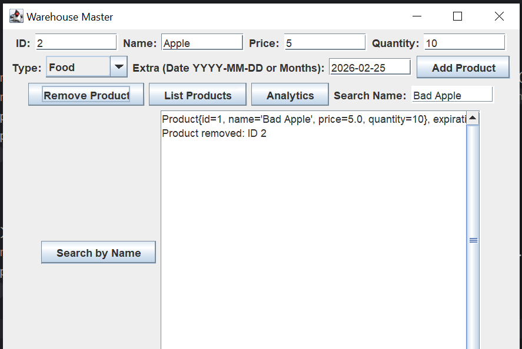

# Warehouse Master

Простое приложение с графическим интерфейсом для учета товаров на складе.  
Написано для пересдачи учебной практики по Java.

### Что умеет программа

- Добавление / удаление товаров двух типов: продукты питания и электроника
- У продуктов питания есть срок годности, у электроники — гарантия в месяцах
- Автоматическая проверка просрочки каждые 30 секунд (вывод в консоль)
- Сохранение и загрузка данных в файл warehouse.json
- Простой поиск по названию
- Подсчет общей стоимости всех товаров на складе
- Показ количества товаров по категориям

### Технологии

- Java 17+ (рекомендуется, при разработке использовал JDK 25)
- Swing (графический интерфейс)
- Gson для работы с JSON
- Stream API для фильтрации и подсчетов
- ScheduledExecutorService для фоновой проверки сроков
- JUnit 5 + несколько тестов
- Gradle для сборки

### Как запустить

1. Открыть проект в IntelliJ IDEA
2. Убедиться, что стоит JDK 17+ (File → Project Structure → SDK)
3. Нажать на иконку Gradle → Reload Gradle Project (или просто перезапустить IDE)
4. Запустить класс `Main` (правой кнопкой → Run)

После запуска откроется окно программы.

### Структура проекта
```
src/
|- main/java/com/example/
|   |- AbstractProduct.java
|   |- FoodProduct.java
|   |- ElectronicsProduct.java
|   |- Warehouse.java           # основная логика, singleton
|   |- ProductStorageStrategy.java
|   |- JsonProductStorageStrategy.java
|   |- ProductTypeAdapter.java   # для Gson
|   |- WarehouseGUI.java
|   |- Main.java
|- test/java/com/example/
|- WarehouseTest.java
```

### Требования реализованные в коде

- private поля + геттеры/сеттеры
- try-with-resources где открываются файлы
- обработка некорректного ввода (через try-catch + JOptionPane)
- использование Stream API в нескольких местах
- паттерн Strategy для сохранения
- singleton для класса Warehouse


## Работа с приложением

Для добавления продукта нужно:
1. Заполнить поля ID, Name, Price, Quantity
2. Выбрать тип продукта: Food/Electronics
3. Написать срок годности для еды и месяцы гарантии для электроники
4. Нажать кнопку "Add product"

Что бы удалить продукт, нужно вписать в поле ID нужное значение и нажать кнопку "Remove product".

Что бы посмотреть все продукты на складе нужно нажать нажать "List Products"

Кнопка "Analytics" показывает общую стоимость всех товаров на скалде и количество продуктов каждого типа.

Так же реализован поиск продукта по имени, что бы это сделать нужно написать в поле "Search Name" название продукта и нажать кнопку "Search by Name"

В основном поле приложения показывается история изменений на складе.


### Пример файла json для работоспособности приложения (Если его не будет создастся пустой автоматически)
```[
[
  {
    "type": "FoodProduct",
    "expirationDate": "2026-02-25",
    "id": 1,
    "name": "Банан",
    "price": 10.0,
    "quantity": 10
  },
  {
    "type": "ElectronicsProduct",
    "warrantyMonths": 12,
    "id": 2,
    "name": "Телефон",
    "price": 10000.0,
    "quantity": 10
  }
]
```